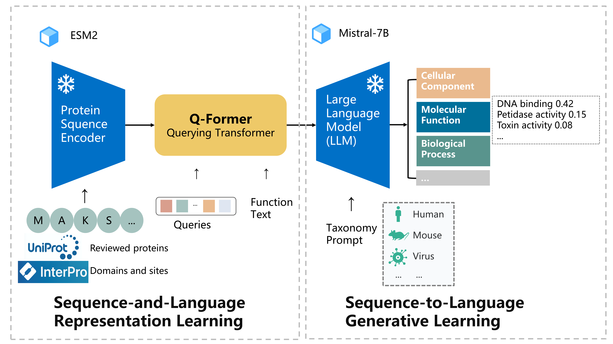

## Introduction
<p align="center">
    <br>
    
    <br>
<p>

## Installation

1. (Optional) Creating conda environment

```bash
conda create -n lavis python=3.8
conda activate lavis
```
 
2. for development, you may build from source

```bash
git clone https://github.com/salesforce/LAVIS.git
cd LAVIS
pip install -e .
```

## Training
data config: lavis/configs/datasets/protein/GO_defaults_cap.yaml \n
stage1 config: lavis/projects/blip2/train/protein_pretrain_stage1.yaml \n
stage1 training command: run_scripts/blip2/train/protein_pretrain_domain_stage1.sh \n
stage2 config: lavis/projects/blip2/train/protein_pretrain_stage2.yaml \n
stage1 training command: run_scripts/blip2/train/protein_pretrain_domain_stage2.sh \n


### Load Datasets


## Contact us

