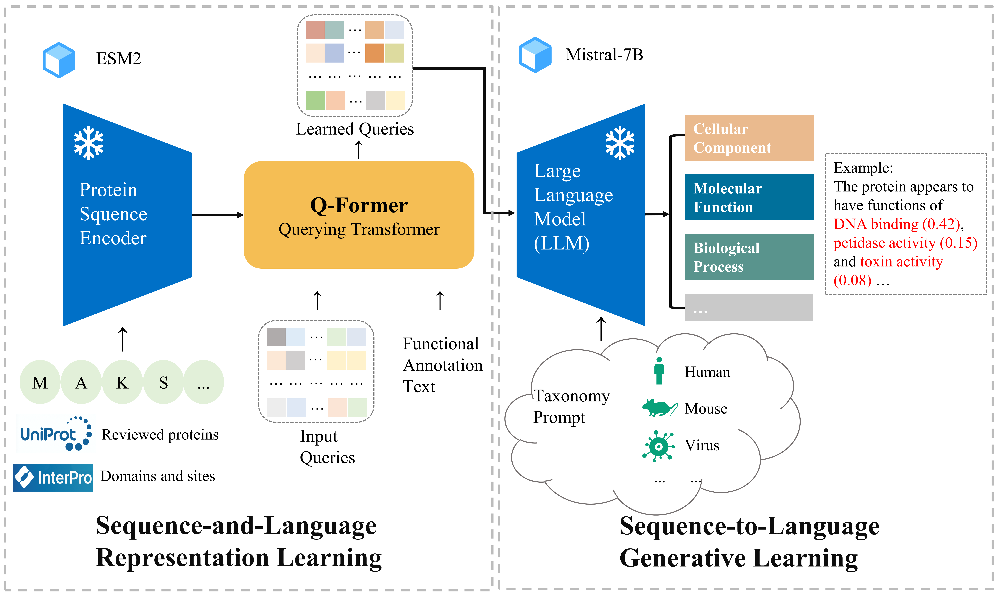

## Introduction
<p align="center">
    <br>
    
    <br>
<p>

## Installation

1. (Optional) Creating conda environment

```bash
conda create -n lavis python=3.8
conda activate lavis
```
 
2. for development, you may build from source

```bash
git clone https://github.com/salesforce/LAVIS.git
cd LAVIS
pip install -e .
```

### Datasets
#### 1.raw dataset
Raw data are avaliable at *https://ftp.uniprot.org/pub/databases/uniprot/previous_releases/release-2023_04/knowledgebase/*, this file is very large and need to be processed to get its name, sequence, GO label, function description and prompt.  
The domain level protein dataset we used are avaliable at *https://ftp.ebi.ac.uk/pub/databases/interpro/releases/95.0/protein2ipr.dat.gz*  
In this respository, We provide the experimental train/val/test sets of Swiss-Prot, which are avaliable at data/swissprot_exp  
#### 2.ESM2 embeddings  
ESM2 embeddings generation code: *https://github.com/facebookresearch/esm*  
The generation command:  
```bash
git clone https://github.com/facebookresearch/esm.git
python scripts/extract.py esm2_t33_650M_UR50D you_path/protein.fasta you_path_to_save_embedding_files --repr_layers 33 --truncation_seq_length 1024 --include per_tok
```
The default path to save embedding files in this respository is **data/emb_esm2_3b**

## Pretraining language models  
Source: *https://huggingface.co/teknium/OpenHermes-2.5-Mistral-7B*

## Training
data config: lavis/configs/datasets/protein/GO_defaults_cap.yaml  
stage1 config: lavis/projects/blip2/train/protein_pretrain_stage1.yaml  
stage1 training command: run_scripts/blip2/train/protein_pretrain_domain_stage1.sh  
stage2 config: lavis/projects/blip2/train/protein_pretrain_stage2.yaml  
stage2 training/finetuning command: run_scripts/blip2/train/protein_pretrain_domain_stage2.sh  

## Trained models
You can download our trained models from drive: *https://drive.google.com/drive/folders/1aA0eSYxNw3DvrU5GU1Cu-4q2kIxxAGSE?usp=drive_link*  

## Testing
config: lavis/projects/blip2/eval/caption_protein_eval.yaml  
command: run_scripts/blip2/eval/eval_cap_protein.sh  

## Inference example
We provide an example in **FAPM_inference.py**. You can change the example protein to you custom case  


