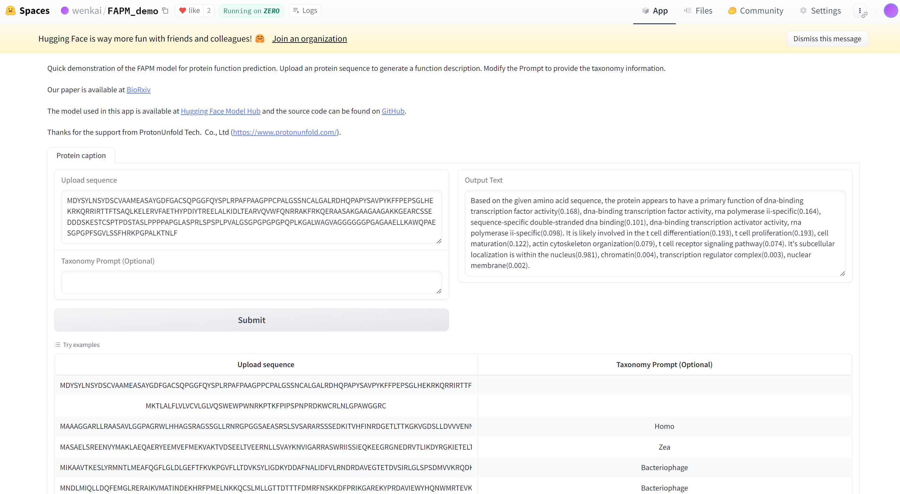

## Introduction
<p align="center">
    <br>
    
    <br>
<p>  
    
Dataset DOI: 10.5061/dryad.m905qfv9p

Huggingface repo: *https://huggingface.co/wenkai/FAPM/*  

FAPM Demo: https://huggingface.co/spaces/wenkai/FAPM_demo  

<p align="center">
    <br>
    
    <br>
<p>  

## Installation

1. (Optional) Creating conda environment

```bash
conda create -n lavis python=3.8
conda activate lavis
```
 
2. for development, you may build from source

```bash
git clone https://github.com/xiangwenkai/FAPM.git
cd FAPM
pip install -e .

# if needed
# pip install Biopython
# pip install fair-esm
```

### Datasets
#### 1.raw dataset
Raw data are avaliable at *https://ftp.uniprot.org/pub/databases/uniprot/previous_releases/release-2023_04/knowledgebase/*, this file is very large and need to be processed to get its name, sequence, GO label, function description and prompt.  
The domain level protein dataset we used are avaliable at *https://ftp.ebi.ac.uk/pub/databases/interpro/releases/95.0/protein2ipr.dat.gz*  
In this respository, We provide the experimental train/val/test sets of Swiss-Prot, which are avaliable at data/swissprot_exp  
#### 2.ESM2 embeddings  
Source code for ESM2 embeddings generation: *https://github.com/facebookresearch/esm*  
The generation command:  
```bash
conda activate FAPM
python esm_scripts/extract.py esm2_t36_3B_UR50D you_path/protein.fasta you_path_to_save_embedding_files --repr_layers 36 --truncation_seq_length 1024 --include per_tok
```
Example:
```
conda activate FAPM
python esm_scripts/extract.py esm2_t36_3B_UR50D data/fasta/example.fasta data/emb_esm2_3b --repr_layers 36 --truncation_seq_length 1024 --include per_tok
```  
The default path to save embedding files is **data/emb_esm2_3b**
You can refer to *data/fasta/prepare_custom_fasta.py* to prepare your custom fasta data.  


## Pretraining language models  
Source: *https://huggingface.co/teknium/OpenHermes-2.5-Mistral-7B*

## Training
data config: lavis/configs/datasets/protein/GO_defaults_cap.yaml  
stage1 config: lavis/projects/blip2/train/protein_pretrain_stage1.yaml  
stage1 training command: run_scripts/blip2/train/protein_pretrain_domain_stage1.sh  
stage2 config: lavis/projects/blip2/train/protein_pretrain_stage2.yaml  
stage2 training/finetuning command: run_scripts/blip2/train/protein_pretrain_domain_stage2.sh  

## Trained models
The models are avaliable at **https://huggingface.co/wenkai/FAPM/tree/main/model**  
You can also download our trained models from google drive: *https://drive.google.com/drive/folders/1aA0eSYxNw3DvrU5GU1Cu-4q2kIxxAGSE?usp=drive_link*  

## Testing
config: lavis/projects/blip2/eval/caption_protein_eval.yaml  
command: run_scripts/blip2/eval/eval_cap_protein.sh  

## Inference example
```
python FAPM_inference.py \
--model_path model/checkpoint_mf2.pth \
--example_path data/emb_esm2_3b/P18281.pt \
--device cuda \
--prompt Acanthamoeba \
--prop True
```  


